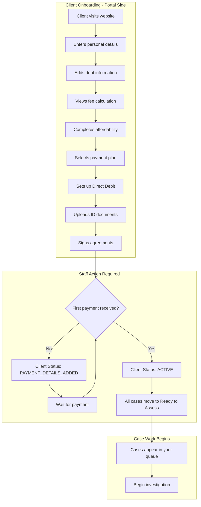
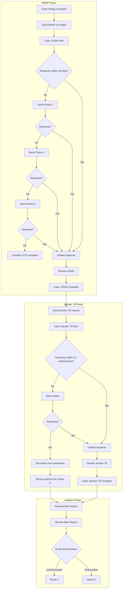
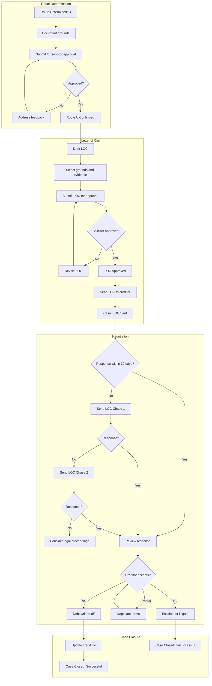
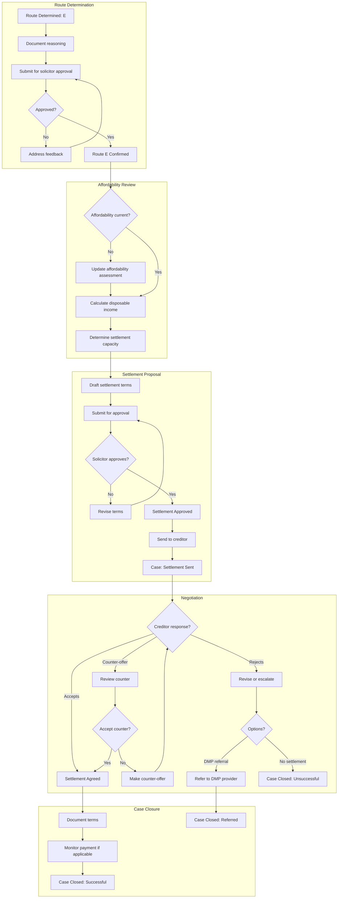
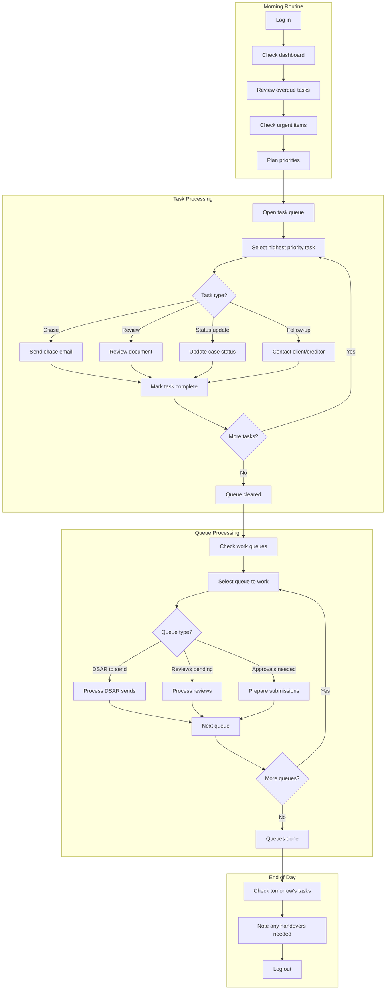
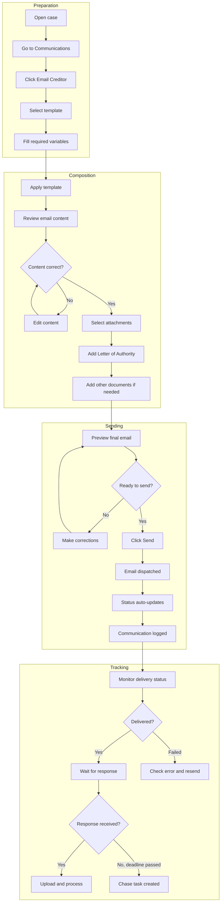
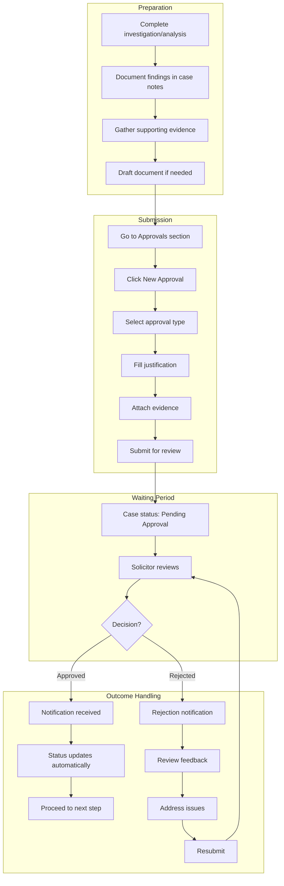

# Staff User Journeys

This guide provides visual walkthroughs of the key workflows you'll perform in the system. Use these diagrams to understand how different tasks connect and what happens at each stage.

---

## How to Use This Guide

Each journey shows:
- The **flow** of tasks from start to finish
- **Decision points** where different paths may be taken
- **Your role** at each step
- **What triggers** the next step

These are reference diagrams - for detailed step-by-step instructions, see the linked documentation.

---

## Journey 1: New Client Onboarding

This journey shows what happens when a new client signs up, from their first visit through to case work beginning.

### Key Points

| Stage | Client Status | Case Status | Your Action |
|-------|---------------|-------------|-------------|
| After signup | PAYMENT_DETAILS_ADDED | Awaiting Payment | Wait for first payment |
| After first payment | ACTIVE | Ready to Assess | Begin DSAR process |

### What You Do

1. **Before first payment:** Nothing - client is completing onboarding
2. **After first payment:** Cases appear in "Ready to Assess" queue
3. **Start investigation:** Send DSAR request

**Related:** [Understanding the Workflow](./02-understanding-the-workflow.md), [Client Management](./03-client-management.md)

---

## Journey 2: Investigation Process

This is the core workflow - investigating whether a debt is enforceable.

### Timeline Overview

| Phase | Duration | Chase Schedule |
|-------|----------|----------------|
| DSAR | 30+ days | Day 30, 60, 90 |
| Section 78 | 12+ working days | Day 42 |
| Maxi Report | 3-7 days | N/A |
| Route Determination | 1-2 days | N/A |

### Decision Points

**Route U (Unenforceable) if:**
- No signed credit agreement
- Missing prescribed terms
- Improper default process
- S78 non-compliance

**Route E (Enforceable) if:**
- Valid agreement exists
- No significant breaches
- Client may benefit from settlement

**Related:** [Investigation Process](./05-investigation-process.md), [Approval Workflows](./08-approvals.md)

---

## Journey 3: Route U - Unenforceable Debt

When investigation reveals the debt is unenforceable, follow this path.

### Approval Checkpoints

| Checkpoint | Who Approves | What They Check |
|------------|--------------|-----------------|
| Route Determination | Solicitor | Evidence supports Route U |
| Letter of Claim | Solicitor | Grounds are valid, wording is correct |

### Typical Outcomes

- **Best case:** Debt written off, credit file corrected
- **Good case:** Partial write-off or settlement
- **Unsuccessful:** Creditor disputes, may need litigation

**Related:** [Approval Workflows](./08-approvals.md), [Documents and Correspondence](./06-documents-and-correspondence.md)

---

## Journey 4: Route E - Enforceable Debt Settlement

When the debt is valid but we can still help through negotiation.

### Settlement Considerations

| Factor | Impact |
|--------|--------|
| Client's disposable income | Determines affordable payment |
| Debt age | Older debts often settle for less |
| Creditor policy | Some accept 30-40%, others need 70%+ |
| Lump sum vs instalments | Lump sum usually gets better discount |

### Typical Settlement Ranges

- **Credit cards:** 30-50% of balance
- **Personal loans:** 40-60% of balance
- **Store cards:** 30-50% of balance
- **Older debts (5+ years):** Often 20-40%

**Related:** [Approval Workflows](./08-approvals.md), [Client Payments](./09-payments.md)

---

## Journey 5: Daily Workflow

A typical day for an Admin staff member handling cases.

### Priority Order

1. **Urgent/Overdue** - Do these first
2. **Due today** - Complete before end of day
3. **Queued work** - Process by queue type
4. **Proactive** - Get ahead when time allows

### Time Allocation Guide

| Activity | Suggested Time |
|----------|----------------|
| Morning review | 15-30 minutes |
| Task processing | 2-3 hours |
| Queue processing | 2-3 hours |
| Admin/meetings | 1-2 hours |
| End of day review | 15 minutes |

**Related:** [Tasks and Work Queues](./07-tasks-and-queues.md), [Case Management](./04-case-management.md)

---

## Journey 6: Document Request to Creditor

The complete flow for sending any formal request to a creditor.

### Template Selection Guide

| Purpose | Template | Key Variables |
|---------|----------|---------------|
| Request all data | DSAR Request | Client, Account, Case Ref |
| Request agreement | Section 78 Request | Client, Account |
| Assert unenforceability | Letter of Claim | Grounds, Evidence |
| Offer settlement | Settlement Proposal | Amount, Terms |
| Follow up | Chase templates | Original Date |

**Related:** [Documents and Correspondence](./06-documents-and-correspondence.md), [Communications](./10-communications.md)

---

## Journey 7: Approval Submission

The flow for submitting any document requiring solicitor approval.

### Approval Types

| Type | When Needed | Typical Turnaround |
|------|-------------|-------------------|
| Route Determination | After investigation complete | 24 hours |
| Letter of Claim | Before sending LOC | 24 hours |
| Settlement Proposal | Before sending settlement | 24 hours |

### Tips for Faster Approval

1. **Be thorough first time** - Complete submissions get faster approval
2. **Reference evidence** - Point to specific documents and findings
3. **Clear justification** - Explain your reasoning clearly
4. **Check before submitting** - Avoid obvious errors

**Related:** [Approval Workflows](./08-approvals.md), [Investigation Process](./05-investigation-process.md)

---

## Journey Maps Summary

| Journey | Primary Role | Duration | Key Checkpoints |
|---------|--------------|----------|-----------------|
| New Client | System/Client | 1-7 days | First payment |
| Investigation | Admin | 8-12 weeks | DSAR, S78, Maxi, Route |
| Route U | Admin + Solicitor | 4-8 weeks | LOC Approval, Creditor Response |
| Route E | Admin + Solicitor | 4-8 weeks | Settlement Approval, Agreement |
| Daily Workflow | All Staff | Daily | Tasks, Queues, Review |
| Document Request | Admin | Minutes | Template, Send, Track |
| Approval | Admin → Solicitor | 24-48 hours | Submit, Review, Decision |

---

## Using These Journeys

### For New Staff

1. Start with **Daily Workflow** to understand your routine
2. Study **Investigation Process** - this is the core work
3. Learn **Document Request** flow for creditor communication
4. Understand **Approval Submission** when you need sign-off

### For Training

Use these diagrams to:
- Explain the overall process
- Show where different stages connect
- Identify handoff points
- Understand what triggers next steps

### For Reference

Keep these journeys bookmarked for:
- Remembering what comes next
- Explaining to clients where their case is
- Onboarding new team members
- Troubleshooting stuck cases

---

## Related Documentation

- [Understanding the Workflow](./02-understanding-the-workflow.md) - Detailed status explanations
- [Case Management](./04-case-management.md) - Working with cases
- [Investigation Process](./05-investigation-process.md) - DSAR, S78, Maxi details
- [Approval Workflows](./08-approvals.md) - Approval process details
- [Tasks and Work Queues](./07-tasks-and-queues.md) - Daily task management
